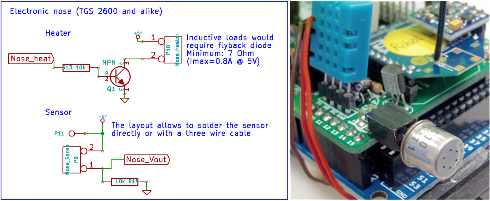

Electronics for the GNBot
=====

GNBoard shield for the Arduino MEGA  
--

An efficient solution for powering mobile robots. The GNBoard can also incorporate a ZigBee-compatible module and many other multimodal sensors (a gas detector for odor sensing, an accelerometer/electronic compass, temperature and humidity sensors, luminosity sensors), and multiple kinds of actuators as well (servomotors, a speaker, LEDs, etc).

  
The two versions of the GNBoard developed for this project.
Prototype design (left) and version 1.0 (right).
The boards are designed to plug into an **Arduino MEGA**.  

The motion of the robot is achieved using two continuous rotation servomotors (**SM-S4303R**) as the main actuators. Servomotors provide a compact and low-cost solution to achieve the digital speed control needed.
The main downside of this kind of actuator is the high current demand -particularly during transient motions- which requires the use of an adequate power supply. For the GNBoard the design decision was to use a switching power supply rather than a linear regulator, provided the much higher efficiency.

  
**Power supply schematic and actual assembly**
**A)** and **B)** respectively show the power supplies in GNBoard v0.1 and v1.0 (final version).
The power supply of the GNBoard uses an **LM2576-5** switching regulator that is capable of delivering up to 3A, which is more than sufficient to cover the energy demand of the entire robot.
Switching power regulators also have a broad input voltage range, allowing to make better use of the full capacity of the batteries since they can be connected in series without negative effect in the performance.

  
**Polarization scheme for the artificial nose sensor and detail picture of the assembly:**
The mounted sensor is the **TGS-2600** gas detector from <http://www.figarosensor.com/>, but any kind of sensor with a similar polarization scheme (as shown in the left panel) could be used.

Layout and schematics  
  
  
  

License  
--
License: **Attribution - Share Alike - Creative Commons (<http://creativecommons.org/licenses/by-sa/3.0/>)**  

Author:  
--
**Carlosgs (<http://carlosgs.es>)**  

Disclaimer  
--
This hardware/software is provided "as is", and you use the hardware/software at your own risk. Under nocircumstances shall any author be liable for direct, indirect, special, incidental, or consequential damages resulting from the use, misuse, or inability to use this hardware/software, even if the authors have been advised of the possibility of such damages.  

