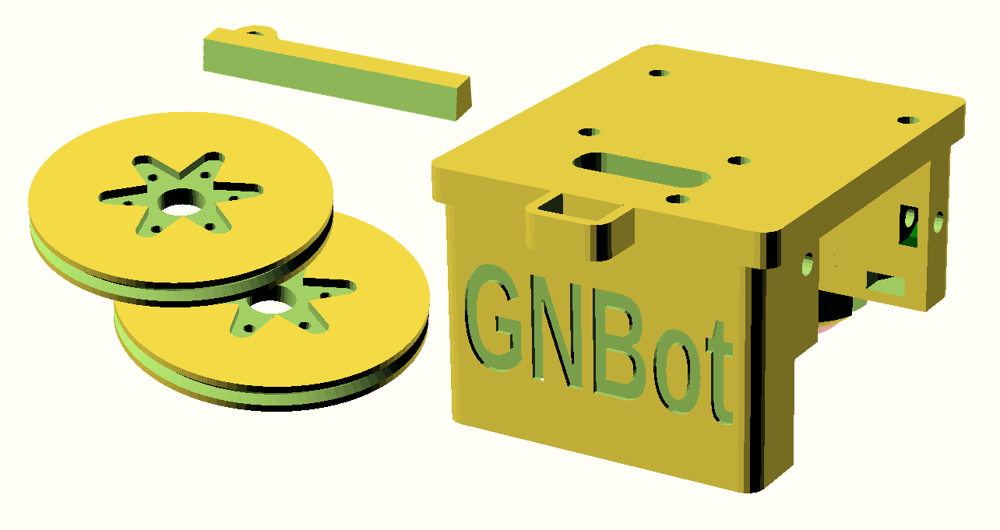
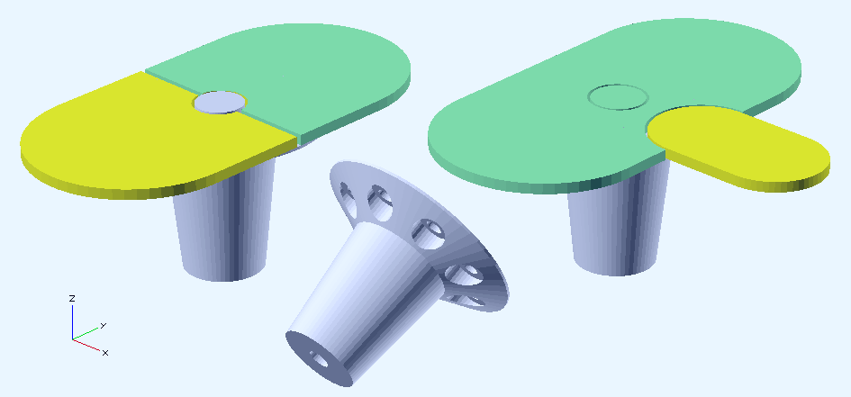

Hardware for the GNBot
=====

Designed derived from the ArduSkybot (whose origin was the MiniSkybot <http://www.iearobotics.com/wiki/index.php?title=Miniskybot_2>)

3d-printable robot design  
--

Regarding swarm robotics, printbots have been preferred over other solutions for both the reduced manufacture cost and, most importantly, for the high adaptability of the designs to the search problems. For instance, the use of 3D printed structures opens the possibility of easily testing the performance of various spatial distributions of the odor sensors in the robot, by manufacturing custom parts that can accommodate the different configurations.

  

**Visual markers for video tracking with OpenCV**  
  

License  
--
License: **Attribution - Share Alike - Creative Commons (<http://creativecommons.org/licenses/by-sa/3.0/>)**  

Author:  
--
**Carlosgs (<http://carlosgs.es>)**  

Disclaimer  
--
This hardware/software is provided "as is", and you use the hardware/software at your own risk. Under nocircumstances shall any author be liable for direct, indirect, special, incidental, or consequential damages resulting from the use, misuse, or inability to use this hardware/software, even if the authors have been advised of the possibility of such damages.  

