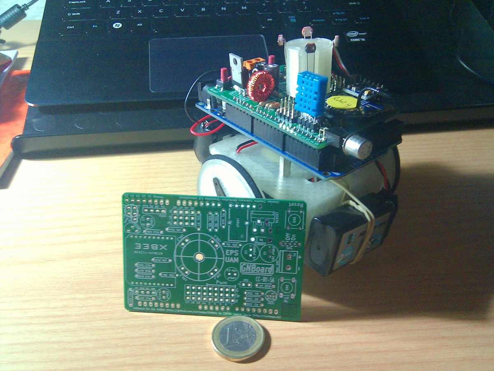
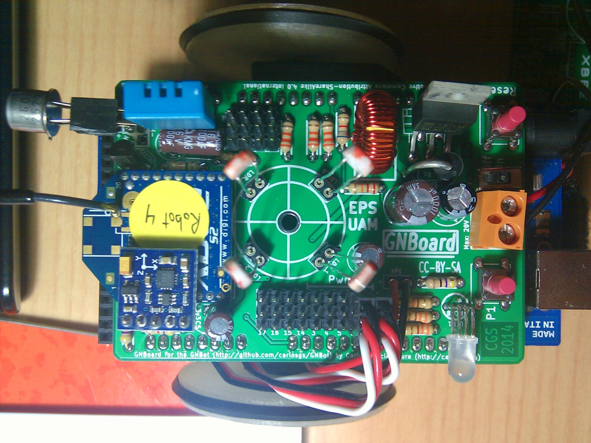
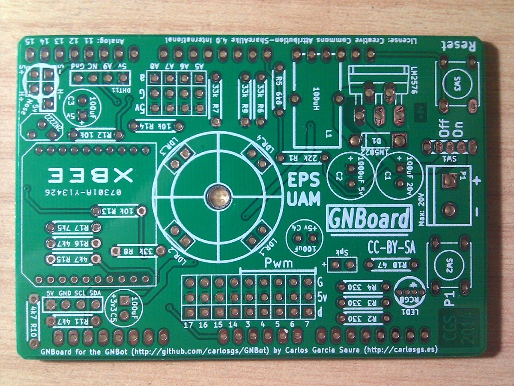
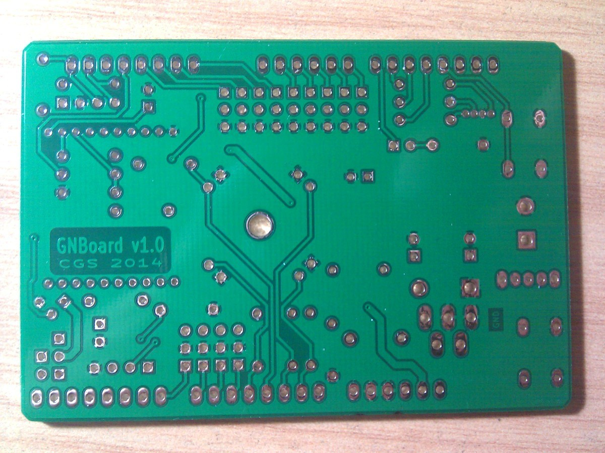
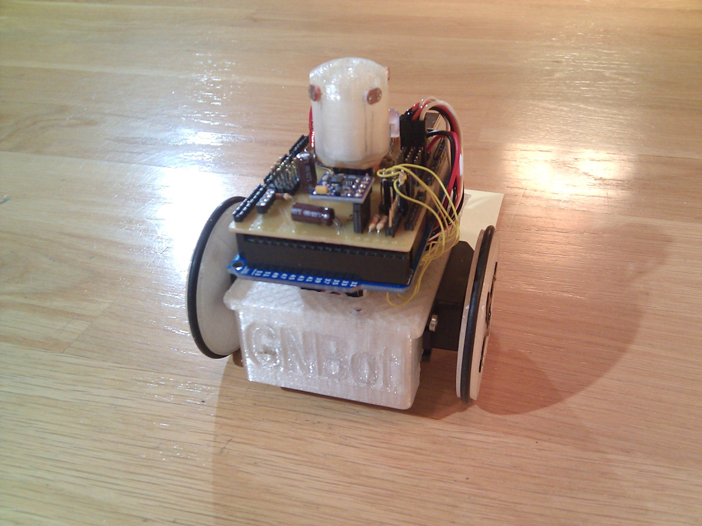
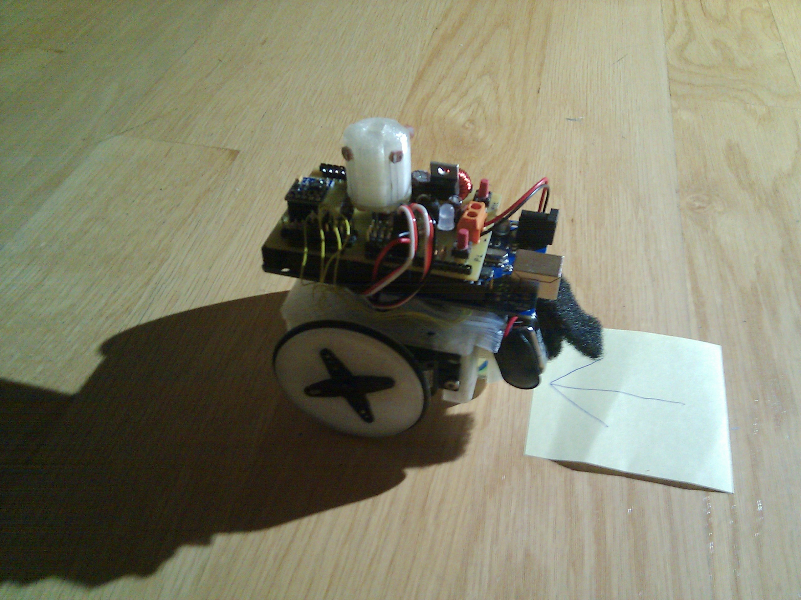
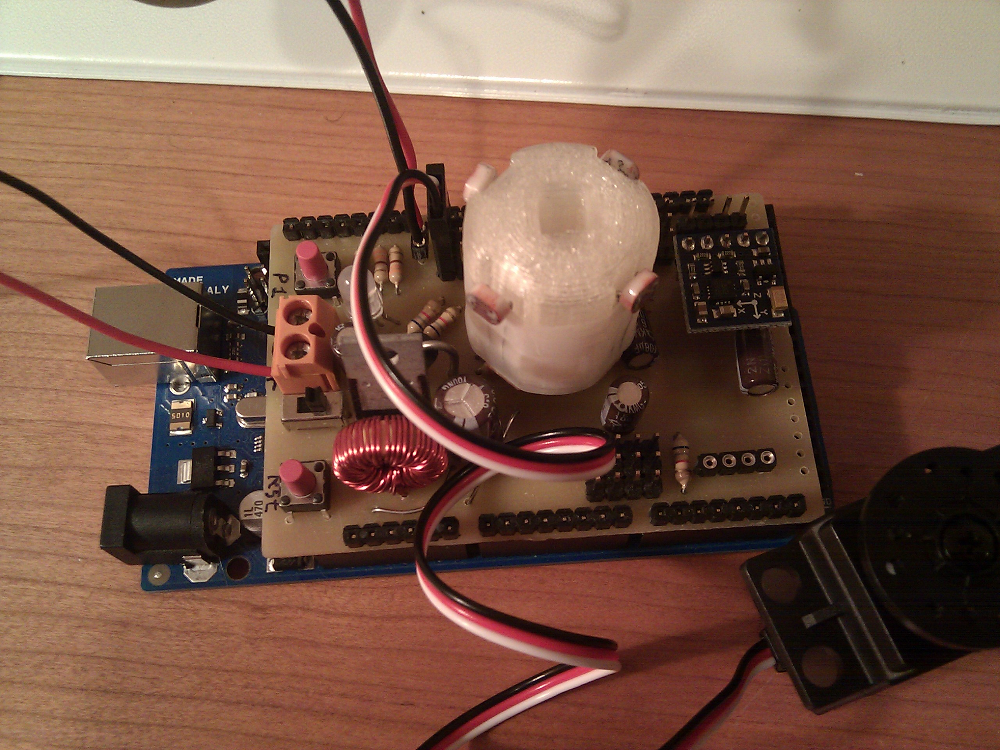

GNBot
=====

A 3D-printable robotic platform for testing swarm algorithms  

**Work in progress**  

**Version 1.0:**  

  
  
  
  

**Version 0.5:**  

  
  
  

License  
--
License: **Attribution - Share Alike - Creative Commons (<http://creativecommons.org/licenses/by-sa/3.0/>)**  

Author:  
--
**Carlosgs (<http://carlosgs.es>)**  

Disclaimer  
--
This hardware/software is provided "as is", and you use the hardware/software at your own risk. Under nocircumstances shall any author be liable for direct, indirect, special, incidental, or consequential damages resulting from the use, misuse, or inability to use this hardware/software, even if the authors have been advised of the possibility of such damages.  

