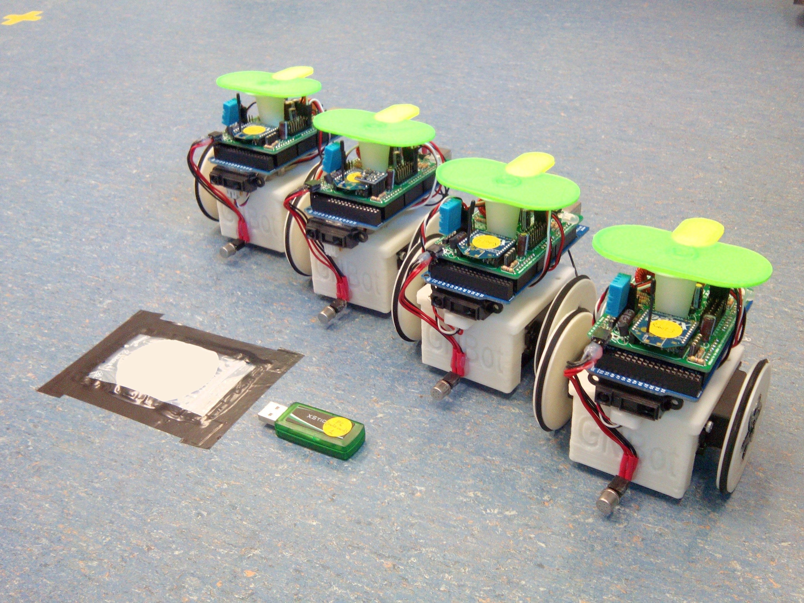
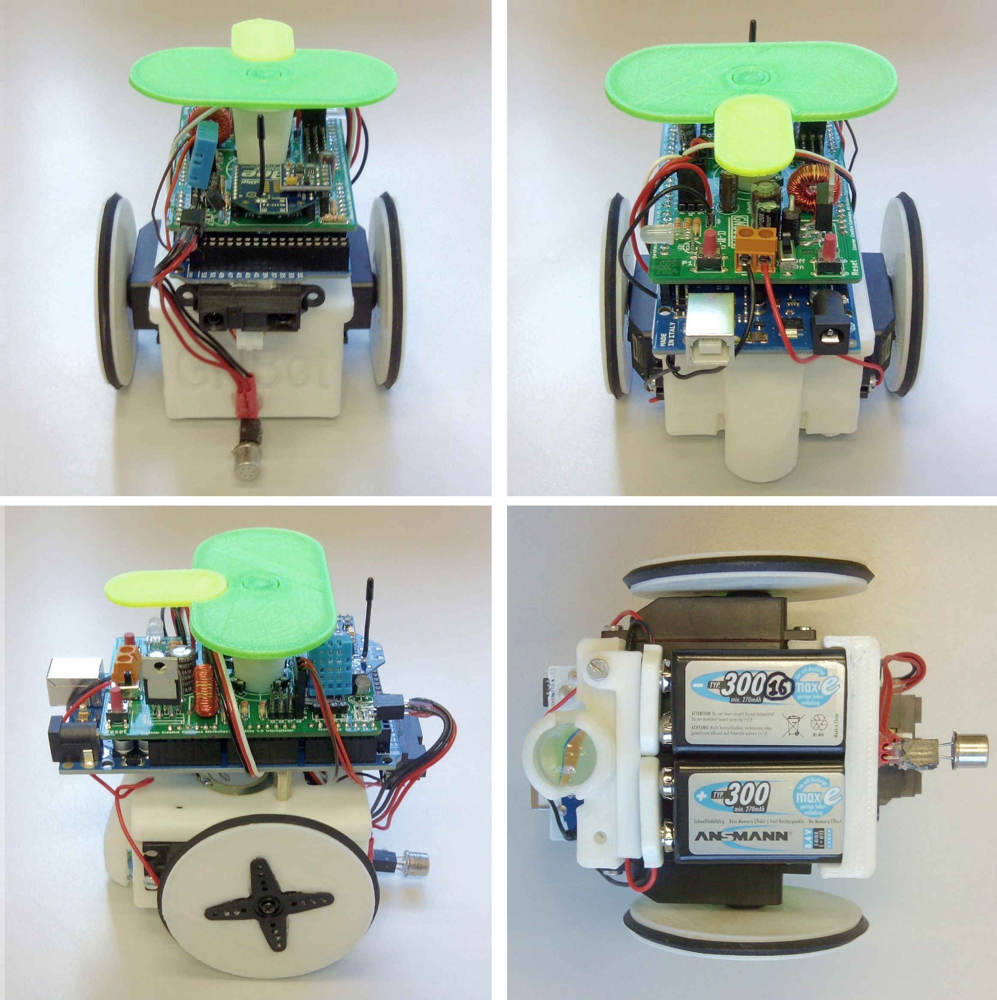
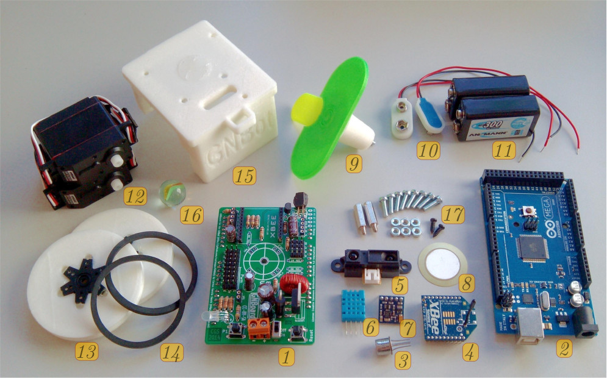

GNBot: robotic platform for cooperative search strategies
=====

Low-cost 3D-printable robot design for testing cooperative search algorithms.  

  

The GNBot design allows the construction of a swarm of remotely-controlled robots that have multimodal sensory input (perceiving light, distance, temperature, humidity and orientation with an electronic compass) and are capable of detecting odor sources such as the low-profile target shown on the left.  

These robots are also energy efficient, open-source and easy to expand to allow the implementation of a great variety of cooperative search strategies (including those that use range information from each sensor modality with a characterization of the uncertainty of odor sources, and also the ones that use classical heuristic or brute-force approaches for search). Most importantly, the standardization of the platform could finally provide a fair base of comparison for evaluating differences in efficiency among these odor search strategies.  

  

List of sensors present in the robot:
TGS-2600 odor sensor, IR rangefinder, LDR light sensor array, electronic compass module, temperature and humidity sensors.
Battery voltage is also monitored.
The base actuators are two servomotors and the wireless interface is based on a ZigBee-compatible module.  

**Version 1.0:**  

  

Items shown in the picture:
**1)** GNBoard electronics.
**2)** Arduino MEGA board.
**3)** TGS-2600 odor sensor.
**4)** ZigBee-compatible RF module.
**5)** Infra-red distance sensor.
**6)** DHT11 temperature and humidity sensor.
**7)** HMC5883L magnetometer sensor.
**8)** Piezoelectric buzzer.
**9)** Visual marker attachment.
**10)** Two 9V battery connectors.
**11)** Two 9V rechargeable batteries (300mAh).
**12)** Two continuous-rotation servomotors.
**13)** 3D-printed robot wheels.
**14)** Rubber outer-wheel rings.
**15)** 3D-printed GNBot chassis.
**16)** Marble for the idler wheel.  

  
  

**Version 1.0a:**  

  
  

**Version 0.5:**  

  

License  
--
License: **Attribution - Share Alike - Creative Commons (<http://creativecommons.org/licenses/by-sa/3.0/>)**  

Author:  
--
**Carlosgs (<http://carlosgs.es>)**  

Disclaimer  
--
This hardware/software is provided "as is", and you use the hardware/software at your own risk. Under nocircumstances shall any author be liable for direct, indirect, special, incidental, or consequential damages resulting from the use, misuse, or inability to use this hardware/software, even if the authors have been advised of the possibility of such damages.  

