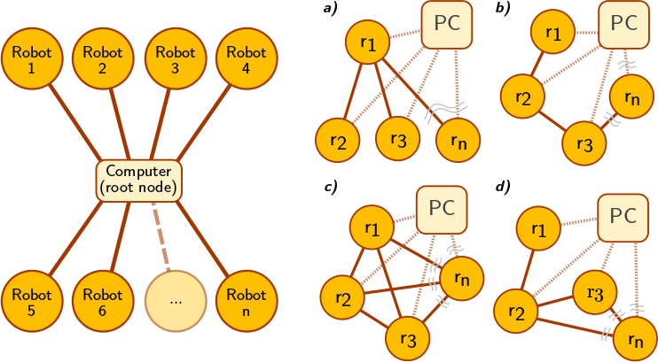
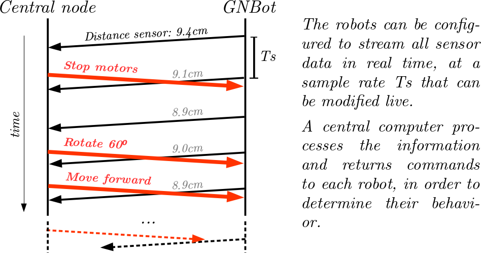
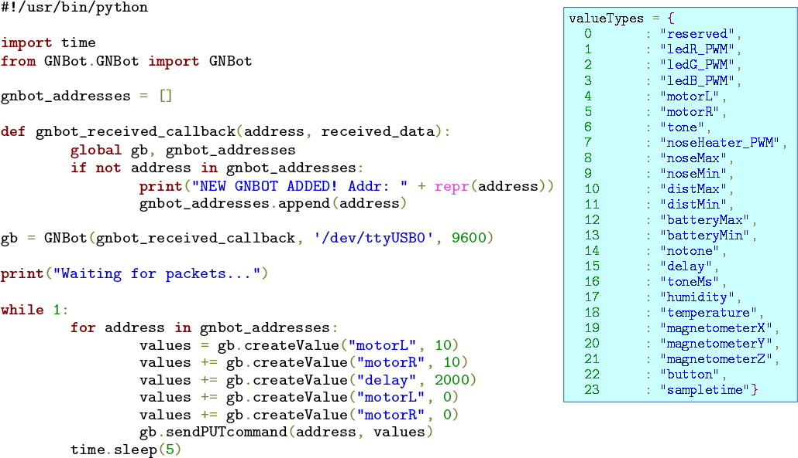

Software for the GNBot
=====

Centralized control architecture  
--
  
The star architecture shown on the left serves as the base to emulate a wide range of topologies. While underlying communications are centralized, the implemented algorithms can have very different requirements. As all information flows through the central computer, virtualized connectivities between robots can be defined in order to achieve various architectures such as **a) tree/star**, **b) line**, **c) fully interconnected**, or **d) mesh**, among others. The emulation of many other characteristics of physical links (**variable delays, jitter, data corruption, packet loss...**) could be used to test the resilience of the implemented search algorithms in a controlled manner.

  

The approach used is to abstract all the calculations to a root computer, effectively using each robot as a peripheral.
A centralized infrastructure is used to command each autonomous robot independently, but a convenient layer of abstraction will also allow testing algorithms that are decentralized (see panels **a-d** in the topology figure. Main advantages of this approach are:  

1. First, it is able to reduce costs since robots are kept simple, with reduced computational ability. For a fixed funding, cutting down the cost of each robot makes it possible to create more of them and thus have a bigger swarm.  
1. Second, as all data flows through the root node, it can be logged and analyzed in order to evaluate the performance of each algorithm and allows easier debugging. Having all information in one place is particularly convenient when testing distributed algorithms.  
1. Third, it provides a layer of abstraction. The code that specifies the behavior of each robot runs on the central computer, and thus a high-level programming language can be used (<http://www.python.org/> was selected for this project). This way it is possible to focus on developing the algorithms rather than dealing with the limitations of memory and power of the micro-controller on board each robot.  
1. Finally, it is important to emphasize that the centralized architecture supports a large dynamic range of complexity of the algorithms, that can be kept simple (i.e. chaotic search) or complex (i.e. particle filtering).  

Simple abstraction control layer, built with Python  
--

  

License  
--
License: **Attribution - Share Alike - Creative Commons (<http://creativecommons.org/licenses/by-sa/3.0/>)**  

Author:  
--
**@CarlosGS** <https://github.com/CarlosGS>

Disclaimer  
--
This hardware/software is provided "as is", and you use the hardware/software at your own risk. Under nocircumstances shall any author be liable for direct, indirect, special, incidental, or consequential damages resulting from the use, misuse, or inability to use this hardware/software, even if the authors have been advised of the possibility of such damages.  

